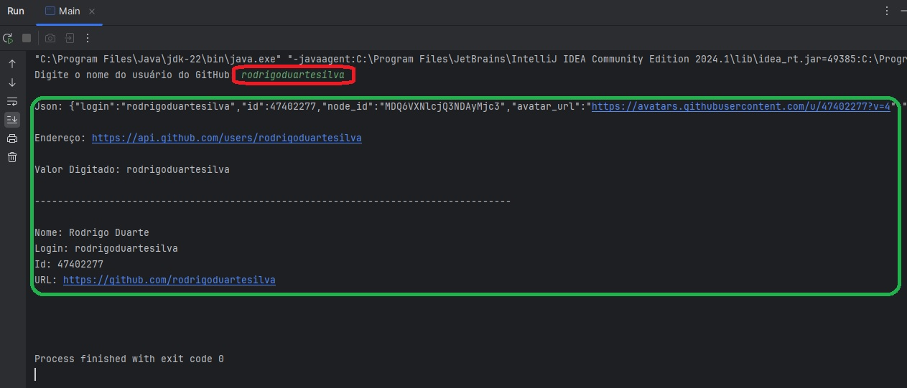

# Exercício - Sistema para consultas de usuário no GitHub

### Autor:

#### Rodrigo Duarte

[Linkedin](https://www.linkedin.com/in/rodrigoduar-te/)

[GitHub](https://github.com/rodrigoduartesilva/)

[Link do Repositório](https://github.com/rodrigoduartesilva/consulta-api-github-java)

Para resolução desses exercícios é necessário ter conhecimentos de : Como criar pacotes, herança, encapsulamento,
uso de getters e setters, sobrescrita de métodos, polimorfimo, interfaces, try/catch (Criar e usar exceções personalizadas).

### Enunciado:

#### Desenvolva um programa em Java que permite aos usuários consultar informações sobre um usuário do GitHub (utilize a API pública do GitHub para obter os dados). Crie uma classe de exceção personalizada, ErroConsultaGitHubException, que estende RuntimeException. Lance essa exceção quando o nome de usuário não for encontrado. No bloco catch, trate de forma específica essa exceção, exibindo uma mensagem amigável.

#### Abaixo segue um passo a passo com a implementação de uma sugestão de resolução:

1. Crie uma classe chamada UserGitHub, está classe terá os atributos name, login, id e html_url, todas do tipo String,
Implemente os getters e setters dos atributos.

```Java

public class UserGitHub {
    private String name;
    private String login;
    private String id;
    private String html_url;

    public String getName() {
        return name;
    }

    public void setName(String name) {
        this.name = name;
    }

    public String getLogin() {
        return login;
    }

    public void setLogin(String login) {
        this.login = login;
    }

    public String getId() {
        return id;
    }

    public void setId(String id) {
        this.id = id;
    }

    public String getHtml_url() {
        return html_url;
    }

    public void setHtml_url(String html_url) {
        this.html_url = html_url;
    }
}

```

2. Crie uma classe chamada ApiGithubConsulta, nessa classe vc deve implementar os pacotes de requisição e resposta da API
(HttpClient e HttpResponse), use também a biblioteca Gson (Link download: https://mvnrepository.com/artifact/com.google.code.gson/gson),
no exercício eu baixei o arquivo e implementei diretamente pela IDE, no entanto, você pode optar por instalar o pacote via terminal.

```Java

import com.google.gson.Gson;

import java.io.IOException;
import java.net.URI;
import java.net.http.HttpClient;
import java.net.http.HttpRequest;
import java.net.http.HttpResponse;

public class ApiGithubConsulta {
    private String gitHubUser;
    private String jsonBody;
    private UserGitHub searchUser;
    private String endereco;

    public String getGitHubUser() {
        return gitHubUser;
    }

    public void setGitHubUser(String gitHubUser) {
        this.gitHubUser = gitHubUser;
    }

    public void consultar() throws IOException, InterruptedException {
        endereco = "https://api.github.com/users/" + getGitHubUser();

        HttpClient client = HttpClient.newHttpClient();
        HttpRequest request = HttpRequest.newBuilder()
                .uri(URI.create(endereco))
                .build();

        HttpResponse<String> response = client
                .send(request, HttpResponse.BodyHandlers.ofString());

        jsonBody = response.body();

        Gson gson = new Gson();
        searchUser = gson.fromJson(jsonBody, UserGitHub.class);
    }

    public ApiGithubConsulta() throws IOException, InterruptedException {

    }

    @Override
    public String toString() {
        return """
               
               Json: %s
               
               Endereço: %s
               
               Valor Digitado: %s
               
               -----------------------------------------------------------------------------------
               
               Nome: %s
               Login: %s
               Id: %s
               URL: %s
            
                
               """.formatted(jsonBody, endereco, getGitHubUser(), searchUser.getName(), searchUser.getLogin(),
                        searchUser.getId(), searchUser.getHtml_url());
    }
}


```

3. O passo seguinte é criar a classe de exceção personalizada, criei a classe com o nome ErroConsultaGitHubException.

```Java

public class ErroConsultaGitHubException extends RuntimeException{
    public ErroConsultaGitHubException(String message) {
        super(message);
    }
}

```

4. E por fim, implementar as chamadas na classe Main para rodar a aplicação.

```Java

package br.com.duarte.exer03atv03.main;

import br.com.duarte.exer03atv03.apigithub.ApiGithubConsulta;
import br.com.duarte.exer03atv03.exceptions.ErroConsultaGitHubException;

import java.io.IOException;
import java.util.Scanner;

public class Main {
    public static void main(String[] args) throws IOException, InterruptedException {
        Scanner scanner = new Scanner(System.in);
        ApiGithubConsulta consulta = new ApiGithubConsulta();

        System.out.print("Digite o nome do usuário do GitHub: ");
        consulta.setGitHubUser(scanner.next());

        try {
            consulta.consultar();
            System.out.println(consulta.toString());
        } catch (ErroConsultaGitHubException error) {
            System.err.println("Usuário não encontrado! " + error.getMessage());
        }
    }
}

```

De acordo com sugerido acima, a saída via terminal deverá ser a exibida abaixo na imagem:



Bons estudos!